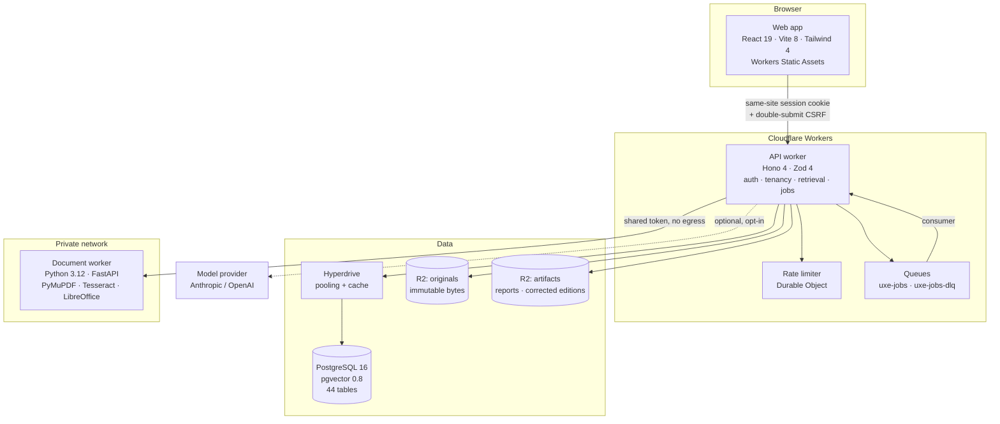
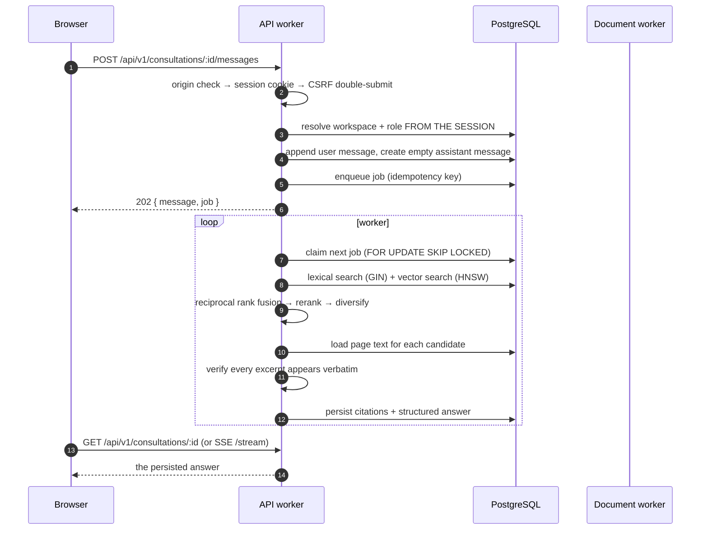
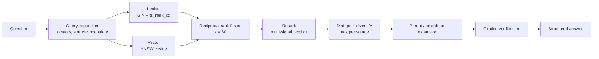
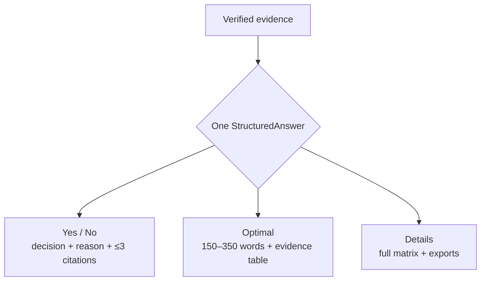

# Architecture

UXE Consulting AI answers questions about a customer's own approved documents, reviews
those documents against regulations, and produces corrected editions. Every claim it makes
is traceable to a quotation that can be re-located in the stored source text.

This document describes how that guarantee is enforced by the structure of the system
rather than by prompt wording.

## Shape of the system



The web bundle is static. It holds no secret, and every byte of tenant data reaches it
through the API over an `HttpOnly`, `SameSite=Lax` cookie.

## Why the document worker is a separate service

The libraries that can open a PDF, a DOCX or a scan reliably are native: PyMuPDF,
Tesseract, LibreOffice. None of them runs on a Workers isolate. Splitting them out has
three consequences that matter more than the deployment cost:

1. **Blast radius.** A malicious document exercises a native parser inside a container that
   holds no database handle, no object-store credential and no outbound network access. The
   worst outcome is a crashed, disposable process.
2. **Scaling shape.** OCR is CPU-bound and slow; the API is I/O-bound and fast. They scale
   on different signals.
3. **Portability.** The API stays on the edge runtime. Nothing in the request path reaches
   for `process.env`, a Node built-in, or the filesystem.

## Request path



The assistant row is created **before** the work starts and updated in place. A refresh
mid-generation therefore always finds something to poll, and the SSE stream is a
convenience rather than the only delivery path.

## Tenancy

Tenancy is not a filter applied at the route layer. It is a parameter of every repository
method:

```ts
async listSources(ctx: TenantContext, params: ListSourcesParams)
```

`TenantContext` is constructed once per request, in the middleware, entirely from the
authenticated session:

```ts
// apps/api/src/middleware/index.ts
const membership = await deps.repos.identity.findMembership(session.userId, workspaceId);
```

No route reads a workspace identifier from the body, the query string or a header. A
client that sends `x-workspace-id` for another tenant is ignored, and the security suite
asserts exactly that.

Source-level ACLs are one predicate, used by both listing and retrieval:

```sql
EXISTS (
  SELECT 1 FROM source_permissions sp
  WHERE sp.source_id = sources.id
    AND ( sp.scope = 'workspace'
       OR (sp.scope = 'users' AND sp.user_id = $userId)
       OR (sp.scope = 'group' AND sp.group_id = ANY($groupIds)) )
)
```

Because retrieval shares that predicate, a document the caller may not open can never
appear as evidence — not even as an unattributed passage.

## Retrieval



Both channels are restricted to the same permitted version set before they run. Fusion is
reciprocal rank fusion, so a passage that both channels rank highly outranks one that only
one channel loves. The rerank is explicit and inspectable — clause proximity, requirement
modality, source authority, recency, quantity presence — rather than a second opaque model.

## Verification: the property the product rests on

A citation is a record, never a model-formatted string. Before it is persisted:

1. the excerpt is searched for in the stored page text, exactly;
2. failing that, in a Unicode- and whitespace-normalised copy, with the match index mapped
   back to the original offsets;
3. if neither matches, the citation is dropped or marked `verified: false` — and the UI
   renders an unverified citation in failure colours, never as evidence.

The consequence is mechanical: the system cannot show a quotation that is not in the
document, because the quotation is looked up rather than generated.

## Answering

The default engine is deterministic and extractive: it selects sentences from retrieved
passages and composes them under a fixed schema. It requires no credentials and cannot
hallucinate, because it never generates prose.

Hosted models plug into the same `ChatProvider` interface. Their output passes through the
identical verification gate — an invented quotation from a frontier model is discarded on
exactly the same code path as one from any other source.



All three depths are projections of the same object. Switching depth re-renders; it never
re-retrieves. Two views of one answer therefore cannot contradict each other.

## Jobs

Every long-running action is a row in `processing_jobs`:

- claimed with `FOR UPDATE SKIP LOCKED`, so any number of workers can drain the queue;
- idempotent by key, so a retried request never duplicates work or artifacts;
- staged, so the UI shows _where_ it is rather than a spinner;
- resumable — a job abandoned by a crashed process is reclaimed after its stale window;
- terminal failures mark the target (message or source) with an actionable reason, so
  nothing is left silently pending.

## Data model

44 tables. The load-bearing ones:

| Group      | Tables                                                                                                                                                     |
| ---------- | ---------------------------------------------------------------------------------------------------------------------------------------------------------- |
| Identity   | `organizations`, `workspaces`, `users`, `memberships`, `groups`, `group_members`, `sessions`, `auth_tokens`, `auth_factors`                                |
| Knowledge  | `sources`, `source_versions`, `source_permissions`, `source_pages`, `source_sections`, `chunks`, `chunk_embeddings`, `requirements`                        |
| Consulting | `consultations`, `consultation_sources`, `consultation_messages`, `attachments`, `citations`, `compliance_reviews`, `findings`                             |
| Output     | `artifacts`, `correction_plans`, `correction_changes`, `document_editions`                                                                                 |
| Operations | `processing_jobs`, `job_attempts`, `idempotency_records`, `audit_events`, `workspace_settings`, `model_configurations`, `connectors`, `retention_policies` |

Eighteen CHECK constraints encode product invariants in the database, not only in
application code — for example, a citation row cannot be marked verified without a
verification method, and a finding cannot be `compliant` while carrying missing-evidence
entries.

`audit_events` has an append-only trigger. `UPDATE` and `DELETE` are rejected by the
database itself, which the integration suite proves by attempting one.

## Migrations

Hand-written SQL, applied by a checksum-verifying runner. A file whose contents change
after it has been applied is a hard error rather than a silent skip.

Expand → migrate → contract: a column is added and backfilled in one release, written by
the next, and only dropped once no deployed version reads it. Rollback therefore never
lands on a schema it cannot read.
